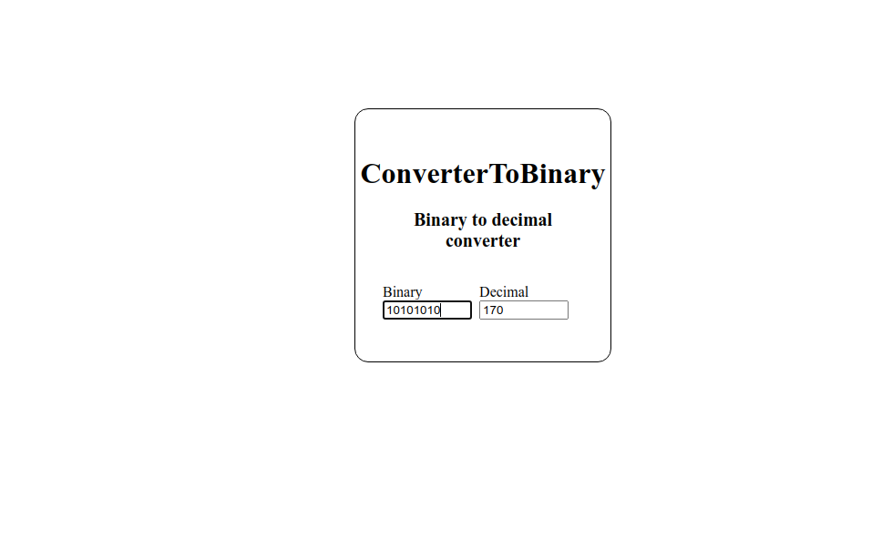

# ConverterToBinary

Computers and digital circuits generally use binary bases to represent quantities, however, we humans use the decimal system, so I decided to develop this simple application to convert numbers from binary to decimal. I hope this project will be of some use to you.
https://acsprudencio.github.io/ConverterToBinary/

